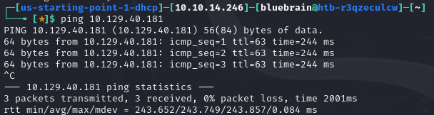
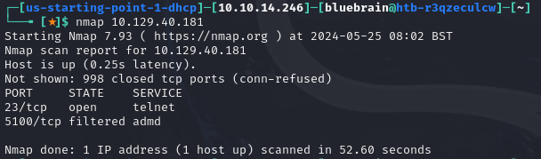
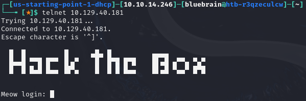
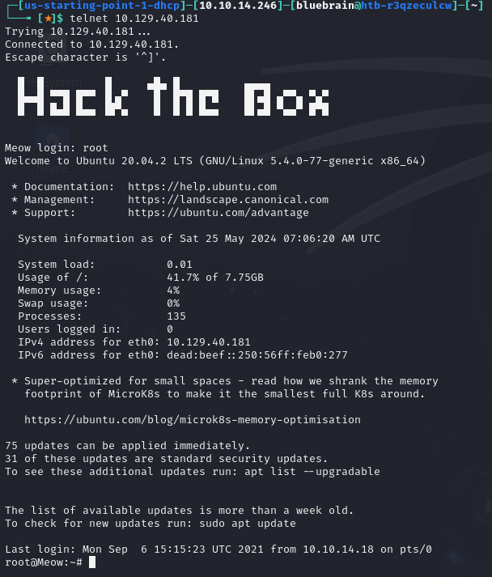
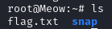
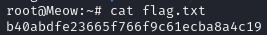

# Meow | HackTheBox Write-up

## Introduction
This box introduces us to many basic concepts and tools used in ethical hacking. We explore using commands such as: ping, nmap, telnet, and more. For this box, to capture the flag, we need to ultimately login to the telnet service running on the box in order to read the file containing the flag (flag.txt).

## Enumeration
To start off, we `ping` (also known as an ICMP (internet control message protocol) echo test) the target box (computer) in order to make sure it is actually alive:

Since we are receiving back packets from the target computer, we can confirm it it up and running.

Next, we are going to run an `nmap` (network map) to enumarate for running services and their respective posts on the target machine:

We can see that port 23 is open, running the service `telnet`. Telnet is an old text-based protocol that allows for remote computer access.

## Telnet

Using the `telnet` command, we can try to login to the target machine:

We are met with a login screen.

After trying various login usernames, we were granted access without a password using login name `root`.

Using the command `ls` (list) we can view what contents are in the current directory.

We see the `flag.txt` file, which is what we are looking for to complete the box. Using the `cat` (concatenate) command we can view the contents of the file.

As we can see, we have captured the flag for this box.

## Various Questions:

### What does the acronym VM stand for?

`Virtual Machine`

### What tool do we use to interact with the operating system in order to issue commands via the command line, such as the one to start our VPN connection? It's also known as a console or shell.

`terminal`

### What service do we use to form our VPN connection into HTB labs?

`openvpn`

### What tool do we use to test our connection to the target with an ICMP echo request?

`ping`

### What is the name of the most common tool for finding open ports on a target?

`nmap`

### What service do we identify on port 23/tcp during our scans?

`telnet`

### What username is able to log into the target over telnet with a blank password?

`root`

### Submit root flag
\#BlueBrain